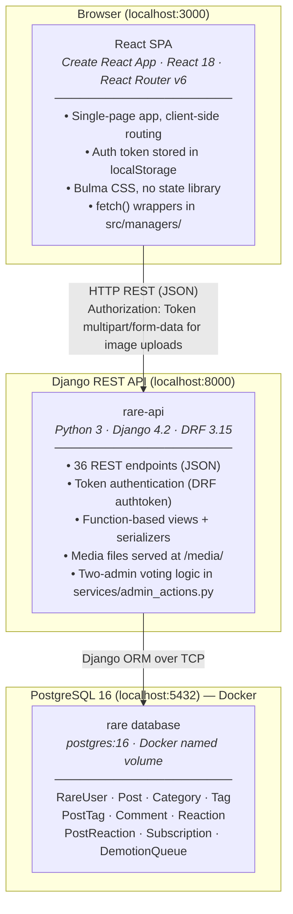

# Rare System Architecture

Rare is a blogging and content moderation platform with a React SPA frontend, a Django REST API backend, and a PostgreSQL database. The client and API run as local dev servers; only the database is containerized.

## Components

### React SPA (`rare-client`)
The entire frontend. Users interact with it to browse posts, write content, manage subscriptions, and (for admins) moderate posts and manage accounts. State is local React state; no Redux or external store. Auth tokens and the current user ID are persisted in `localStorage`.

### Django REST API (`rare-api`)
The entire backend. Owns all business logic, authentication, and data access. Exposes 44 RESTful endpoints grouped by resource: auth, posts, categories, tags, comments, reactions, profiles, and the admin demotion queue.

Key rules enforced at the API layer:
- Posts by regular authors require admin approval before they appear publicly.
- Deactivating or demoting an admin account requires two separate admins to make the same request (two-admin voting via `DemotionQueue`).
- Subscription feeds filter on `ended_on IS NULL` (soft-delete unsubscribe).

### PostgreSQL Database
Sole persistent store, running in Docker with a named volume for durability. The Django ORM is the only client; no raw SQL queries exist in the application layer.

## Communication

| Link | Protocol | Details |
|---|---|---|
| Browser → API | HTTP REST | JSON bodies; `Authorization: Token <key>` header; `multipart/form-data` for image uploads |
| API → Database | TCP (Django ORM) | psycopg2 driver; connection configured in `settings.py` |

There are no WebSockets, message queues, background workers, caches, CDNs, or third-party service integrations.
