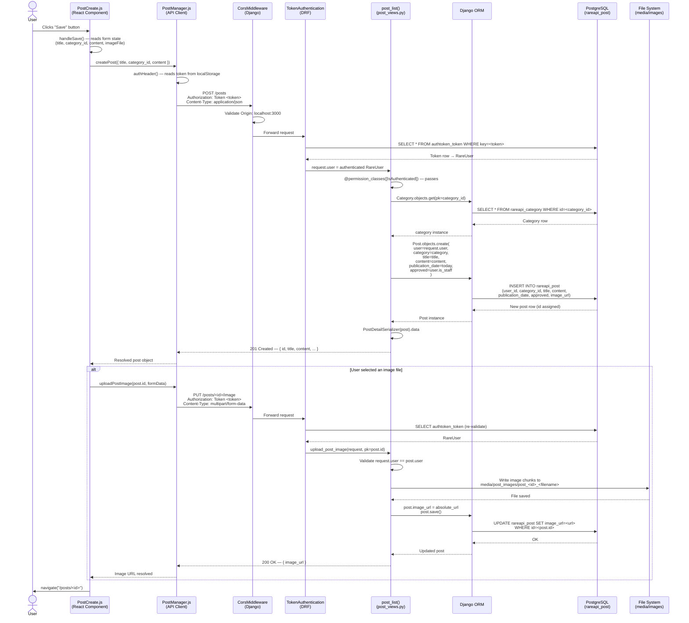

# Create Post — Sequence Diagram

## Participants

| Participant | File |
|---|---|
| `PostCreate.js` | [rare-client/src/components/posts/PostCreate.js](../../rare-client/src/components/posts/PostCreate.js) |
| `PostManager.js` | [rare-client/src/managers/PostManager.js](../../rare-client/src/managers/PostManager.js) |
| `post_views.py` | [rare-api/rareapi/views/post_views.py](../rareapi/views/post_views.py) |
| `post_serializers.py` | [rare-api/rareapi/serializers/post_serializers.py](../rareapi/serializers/post_serializers.py) |
| `post.py` (model) | [rare-api/rareapi/models/post.py](../rareapi/models/post.py) |
